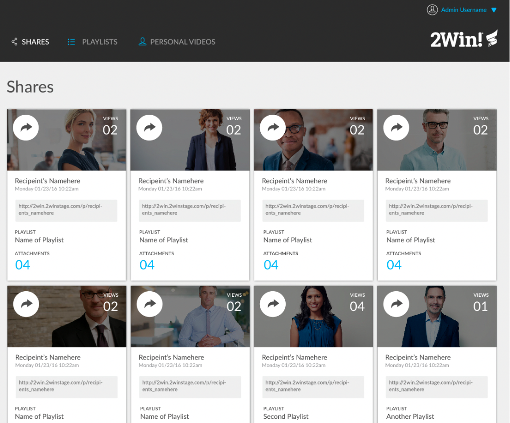
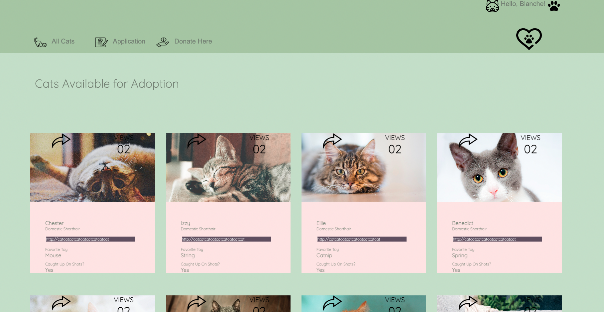

# Static Comp

## About This Project

### Learning Goals

This project was meant to further develop our CSS and HTML skills. We were given a static comp to replicate, but were able to experiment with a different theme while remaining true to the layout provided, as seen below.

I chose to make a cat adoption website that featured adoptable cats, a brief description of their breed, their favorite toy, and whether they were caught up on their shots, as seen below.

I worked on this project for three days during week three of Module 2 at Turing School of Software Design.

### Technologies Used

- HTML
- CSS
- Other Resources: Coolors, Pexels, Flaticon, Google Fonts

## Install or Viewing Instructions

- Please use this link: https://bhaddad1.github.io/static-comp/
- Alternatively, git clone this repository into a directory of your choosing.
- cd into the Repository.
- Open the repo on your code editor.
- Run `open index.html` to view in your browser.

## Wins and Challenges

- Some challenges included building the proper layout to have everything display on the page in the correct areas. I started out using CSS Grid and eventually turned back to flexbox, my old friend.
- Some wins included choosing a color scheme I was happy with, and sizing background images of cats correctly.

## Future Iterations or Features of this Project

- Build the functionality of this app, so that a user can view adoptable cats in their city by being led to external sites.
- Add a page to view the adoptable cat's story.
- Feature adopted cats and where they are now.

## Contact

[Blanche Haddad's Github](https://github.com/BHaddad1)
[Blanche Haddad's LinkedIn](https://www.linkedin.com/in/blanche-haddad-denver/)
